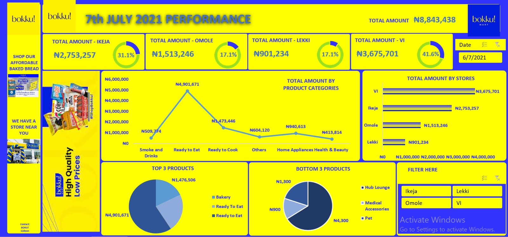

# Bokku- Store
An in-store retail outlet

.jpeg)

## Introduction

Bokku! - Discount Grocery Store  is a fast-growing hard discount store🚀🚀 It is a rapidly rising chain with multiple stores across various states in Nigeria.

While reviewing one of their daily records, I compiled the following information from the dataset, which included four columns: date, product categories, store location, and amount

## Problem Statement 
1. What is our total revenue over the cost of 4 years
2. What is the total quantity of product product sold during this period
3. Who are the top performing manager
4. What is the total revenue by country and city

## Skills / Concept demonstrated

The following Excel features were incoporated: 

- Modelling
- Filters
- Tables
- Pivot Table
- Pivot Charts
- Slicers
- Themes
- Field items
- Timeline

## Visualization and Insights

The number of product items is more extensive than what is visually represented; I re-grouped them into more relatable items.
Identified the top 3 selling products.
Identified the bottom 3 selling products.

Determined the best-selling stores and other pertinent details.

The tool used for this analysis was Microsoft Excel. This marks my second Excel dashboard project. Despite having worked on several projects using PowerBI, I wanted to experiment with Excel, and I thoroughly enjoyed the process.

FYI - BOKU! recently celebrated the opening of their 30th store in Bariga on September 29, 2023

P.S -  Shop with Bokku_Stores today! 

THANK YOU 😄

Chat me up on Linkedln: http://linkedin.com/in/salau-gideon-ond-aat-bsc-and-aca-in-view-330a4a1a0

Twitter: @LateefGideon

Whatsapp: 08100657265

